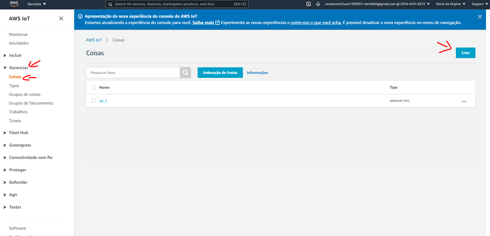
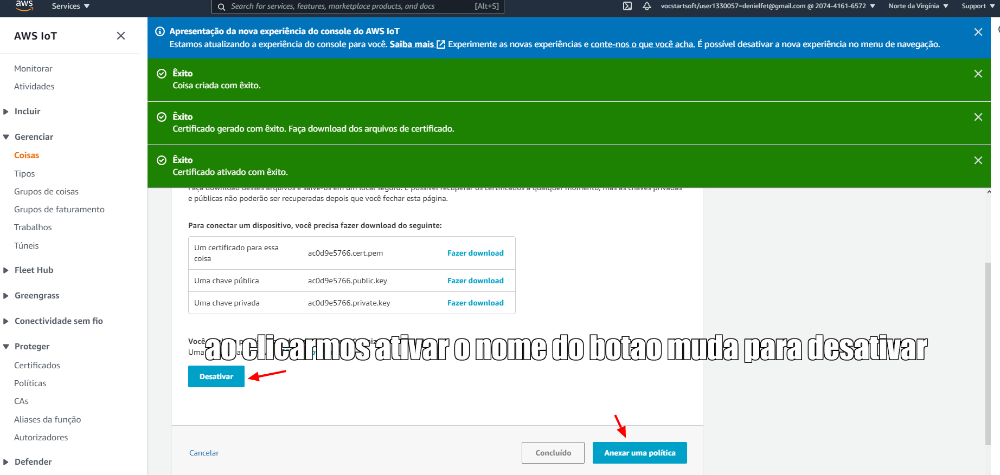
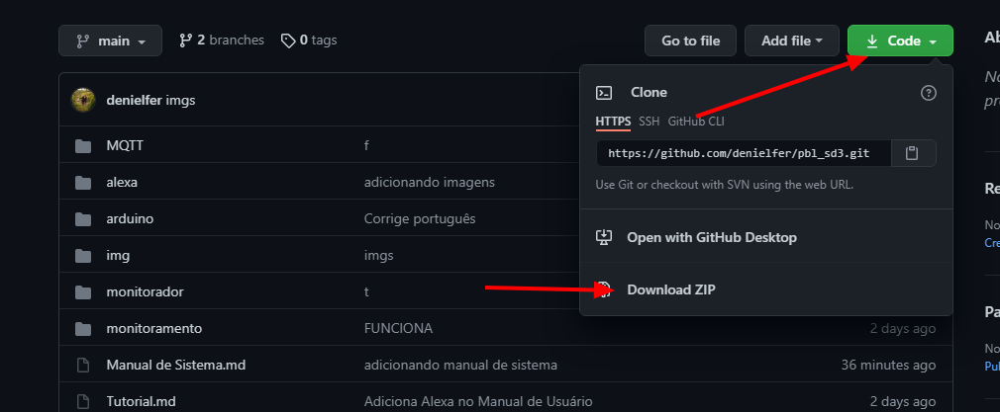
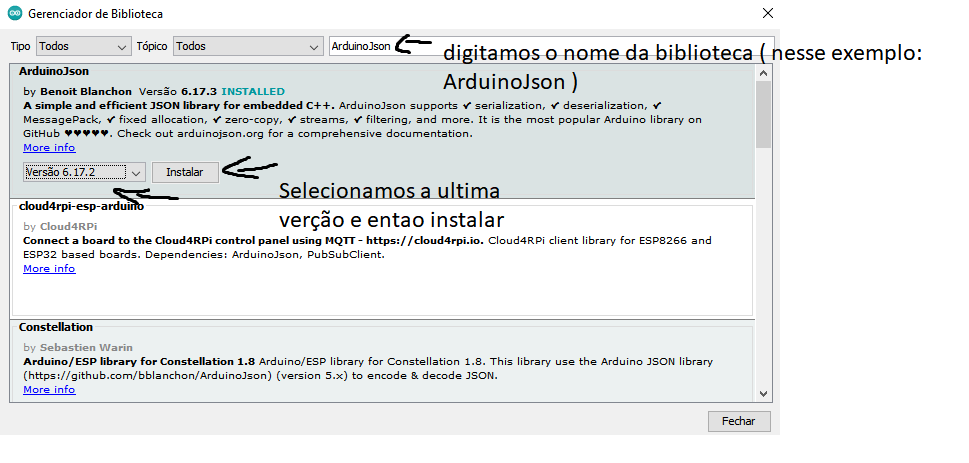
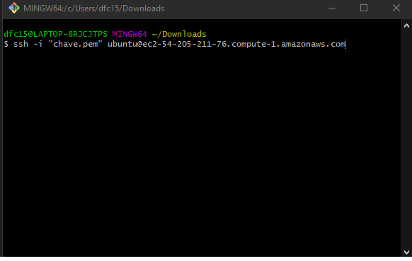
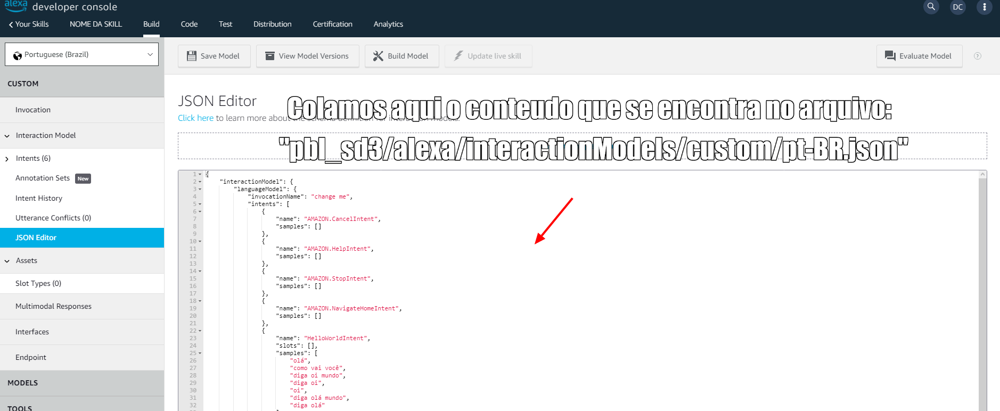

# Automação residencial
Este arquivo contém o manual do sistema e após ele o manual do usuário.
## Manual de sistema

### Entrando no IoT core

Primeiramente precisamos registrar a nossa coisa no AWS e pegar os certificados para podermos conectá-la no MQTT do AWS. Para isso vamos entrar na nossa conta. Então procuramos por "IoT core", como na imagem abaixo:


### Criando política

Vamos em proteger, em políticas e em criar:


Colocamos um nome em nossa política (para o exemplo demos o nome de politicaNodeMcu) e colocamos * em ação, marcamos permitir na checkbox e clicamos em criar:


### Registando a coisa no AWS

Então no menu lateral vamos em gerenciar, depois em coisas e por fim criar:



Para registrar a coisa clicamos em criar uma única coisa:


Então escolhemos um nome para a coisa ( no exemplo foi escolhido node_mcu) e clicamos em proximo:


Clicamos então em criar certificados:


Então fazemos o download de todos os certificados e do nosso CA da amazon (esses arquivos são importantes e nao devem ser compartilhadas ou perdidos), ao clicarmos em fazer download do CA da amazon vamor ser levados a outra página:


Nessa nova página vamos salvar o conteúdo do amazon root CA 1 como arquivo de texto junto aos certificados. Para tal, clicamos com o botão direito do mouse e em "Salvar conteúdo do link como":


Então clicamos em ativar e axenar uma política:



Selecionamos a política que criamos e clicamos em "Registrar a coisa":


Assim conseguimos 1 conjunto de certificados para ser usado, entao repetimos esse processo mais 2 vezes para termos 3 conjunto de ceritficados ( 1 que sera upado na placa, 1 para a aplicação WEB e 1 para ser usado pela alexa )

### Carregando o código na placa

Entao faremos o download do código disponível no git na nossa máquina:



Colocamos um conjunto de certificados e do AmazonRootCA na pasta:  "pbl_sd3/arduino/certificados", outro na pasta "pbl_sd3/MQTT/certificados" e o ultimo na pasta "pbl_sd3/alexa/lambda".
Então abrimos o prompt de comando na pasta "pbl_sd3/arduino/certificados" e digitamos:

```
openssl x509 -in {nome_do_arquivo_de_certificado} -out crt.der -outform DER
openssl rsa -in {nome_do_do_arquivo_da_private_key} -out private.der -outform DER
openssl x509 -in AmazonRootCA1.pem -out ca.der -outform DER
```

Assim, geramos os arquivos dos certificados que serão carregados na placa.

Caso esse passo não dê certo pode ser necessário baixar e instalar o OpenSSL.

Ao terminarmos esse passo, em nossa pasta "pbl_sd3/arduino/certificados" deverá ter sido criado os arquivos "ca.der", "crt.der" e "private.der".
Então movemos estes 3 arquivos que foram criados, para a uma pasta "pbl_sd3/arduino/data". Ao terminarmos esses passos nossas pastas dentro de "pbl_sd3/arduino" devem estar dessa forma:

```
-certificados
--{Certificado_baixado_do_aws}
--{chave_privada_baixado_do_aws}
--{chave_publica_baixado_do_aws}
--AmazonRootCA1.pem
-data
--ca.der
--crt.der
--private.der
-ler_arquivos
--ler_arquivos.ino
-arduino.ino
```

Então voltamos para a pasta "pbl_sd3/arduino" e abrimos o código (caso ainda não tenha instalado, instale a última versão da IDE do arduino ou atualize, caso necessário). E iremos em "Ferramentas", depois em "Placa" e por fim, "Gerenciador de placas":


Será aberta uma janela, e na barra de busca digite: "EPS8266", e clique em "Instalar" no elemento "esp8266":


Após ter terminado de instalar, clicamos novamente em "Ferramentas", "Placa", "ESP8266" e por fim em "NodeMCU 1.0":


Com a placa conectada ao computador garantimos que os dados serão enviados para o lugar correto, em "Ferramentas", vamos em "Porta" e selecionamos a porta na qual a placa está conectada (indicado pelas setas pretas) e por fim clicamos em "ESP8266 Sketch Data Upload" (indicado pela seta vermelha):


Ao realizarmos isso estaremos upando os aquivos da pasta data para a placa e então alteramos no código do arduino as variáveis: id_rede, senha_rede e AWS_endpoint.


Caso não saiba seu endpoint do AWS, basta ir na tela do IoT core e em "Configurações", na página estará disponível seu endpoint.


Também será necessário baixar 3 bibliotecas do arduino. Para isso, na IDE do arduino, vamos em "Sketch", "Incluir biblioteca" e "Gerenciar bibliotecas":


Então será aberta uma janela e nela vamos digitar o nome da biblioteca e clicar em "Instalar", repetindo esse processo para todas as bibliotecas que nao estiverem instaladas. Sendo necessário baixar:

- PubSubClient
- NTPClient
- ArduinoJson

Aqui temos um exemplo da instalação da biblioteca ArduinoJson:



Agora podemos upar o sketch para a placa pelo botão que contém uma seta no topo do menu:


### Criando a máquina virtual

Para carregarmos o servidor, vamos de volta ao AWS e dessa vez abrimos o EC2 ao invez do IoT Core, para abrirmos o EC2 o passo a passo é similar ao do IoT core porém dessa vez buscamos por EC2 no lugar de IoT core.

Então vamos em "Instâncias", "Instâncias" e "Executar instância":


Vamos em AMIs da comunidade, Ubuntu e selecionamos a primeira (Ubunu-focal-20.04) : 


Selecionamos a instância que queremos (nesse projeto o servidor será rodado na instância t2.micro) e clicamos para ir em "Configure os security group":


Deixamos marcado "Criar um grupo de segurança novo", "Clicamos em add rule" 2 vezes, e colocamos 1 das caixas adicionadas com HTTP e outra como HTTPS:


Então clicamos em "Verificar" e "Ativar" no canto inferior direito.

Na nova tela que somos levados clicamos em executar. E vai aparecer para escolhermos uma chave, caso já tenha um, basta colocar na dropbox "Escolher um par de chaves existentes", para criar um par, basta ir em dropbox e colocar "Criar um novo par de chaves" e colocar o nome para essa chave no campo de baixo e clicar em download (no exemplo colocamos o nome chave), após fazer o download, o botão executar instância estará disponivel e basta clicar nele:


Então seremos redirecionados para uma página mostrando que a instância foi lançada e clicaremos em exibir instâncias:


Então iremos na página onde temos nossas instâncias e clicaremos no nome da instância que acabamos de criar, caso haja várias instâncias, basta filtrar pela "Data de lançamento" e selecione a mais recente

Então ao clicarmos no nome da instância que acabamos de criar, seremos jogados para uma página da instância, então anotaremos o endereço de IPv4 público da instância e clicaremos em "Conectar":


Então clicaremos em cliente SSH e copiaremos o exemplo:


### Colocando o servidor no ar

Então para usuários Linux abriremos a pasta que tem a chave que acabamos de baixar e executaremos o comando que copiamos, e pressionar ENTER. Para Windowns recomenda-se baixar o git bash e executar o git bash na pasta que foi colocada a chave baixada e colar o comando copiado e dar ENTER:



Então digitamos "yes" e pressionamos ENTER para adicionar essa máquina aos hosts conhecidos e por fim estaremos dentro da máquina.

A princípio, digitaremos os seguntes comandos para atualizar o SO:

```
sudo apt update
```

e após o término

```
sudo apt upgrade -y
```

para realizar todas as atualizações.
Então executaremos o codigo abaixo para clonar o esse github, sendo nescessario upa os certificados do aws na maquina tambem ( isso pode ser feito upando os certificados em algum serviço de cloud storage e baixando pela maquina ):

```
git clone {link desse github}
```

e 

```
sudo apt install python3-pip
```

abrimos a pasta "pbl_sd3" com:

```
cd pbl_sd3/
```

e executamos:

```
sudo pip3 install -r requirements.txt
```
Também precisamos upar nossos certificados no servidor (pode também ser editado nos arquivos locais e carregar esses arquivos no git ao invés de baixar direto desse git, baixamos do que foi upado). Após eles terem sido upados para la é necessário que abra o arquivo MQTT.py (que se encontra na pasta MQTT) com os comando:

```
cd MQTT/
nano MQTT.py
```

e editemos o path dos certificados e o colocamos nosso endpoint do AWS:

```

...
client.configureEndpoint("{seu_end_point_do_aws}", 8883)
client.configureCredentials("{path do /AmazonRootCA1.pem}",
                            "{path_da_private_key}",
                            "{path_do_certificado}")

client.connect()
...
```

Sem esses dados não será possível usar o MQTT broker do AWS, para achar o path dos arquivos no servidor basta digitar o comando "pwd" estando na pasta dos paths, que então será escrito no terminal o path dessa pasta, bastando adicionar o "/{nome_do_arquivo}" para se ter o caminho do mesmo. E então voltamos uma pasta com:

```
cd ..
```

e executamos o seguinte comando:

```
sudo python3 manage.py runserver 0.0.0.0:80
```

Assim abrimos o servidor na porta :80 da máquina aberta para qualquer um acessar.
Então basta colocar o IPv4 da máquina do seu navegador e estará acessando o site, garanta que está acessando a porta 80 digitando: "HTTP://{IPv4}".


#configurando alexa

Para confirgurarmos a alexa sera nescessario acessao o "alexa developer console" no link: https://developer.amazon.com/alexa/console/ask
Entao para criarmos nossa skil clicamos em "Criar skill"


Entao colocamos no nome da nossa skill e selecionamos alexa-hosted (Python) no final da pagina e entao precionamos em "Create skill"


entao clicamos em "Continue with template"


entao vamos em "Interaction Model" e em "JSON Editor"


abrimos o arquivo ( do projeto que foi baixado deste git ) "pbl_sd3/alexa/interactionModels/custom/pt-BR.json" com um editor de texto e copiamos o codigo desse arquivo e colamos no editor mostrado no "JSON Editor da alexa"



entao vamos em "invocation" e definimos como desejamos inicia essa skill da alexa e clicamos em "Build Model"


Então zipamos a pasta "pbl_sd3/alexa/lambda" (ja com os certificados) e vamos em "Code" e "import code" e colocamos esse zip que acabamos de fazer.


ainda na aba "Code" do alexa developer console abrimos o arquivo MQTT.py que upamos e vamos colocar o nome do arquivos de certificado que colocamos la:

```
def iniciar():
    client.configureEndpoint("{Seu AWS endpoint}", 8883)
    client.configureCredentials("{seu AmazonRootCA}", 
                                "{ Nome do arquivo contendo a chave privada }",
                                "{ Nome do arquivo contendo o certificado }")
```

e no arquivo "lambda_function.py" altere o ipv4, conforme:

```
logger.setLevel(logging.INFO)

ipv4 = "{Endereço do site (ex: HTTP://{ipv4}) }"
status = "Desconectado"
```

e entao clicamos em deploy no canto superior direito. Assim essa skill esta vinculada a nossa conta da amazon usada no alexa developer console e podemos acessa ela em dispositivos logados com essa conta, sendo nescessario ativar nos dispositivos.
