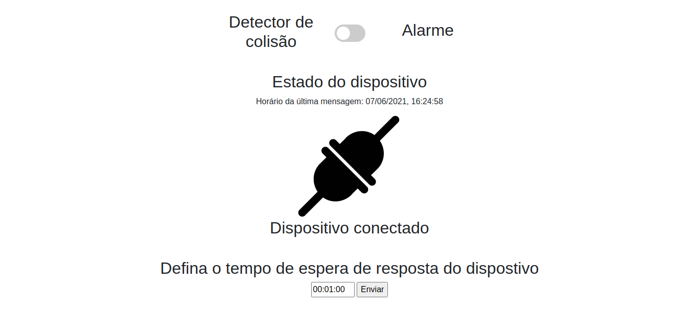

#Manual do Usuário

##Página Web

###1. Pré-Requisistos
- Conexão com a Internet;
- Sistema Operacional;
- Navegador.

###2. Acesso ao sistema
- Para acessar o site, digite a seguinte URL em seu navegador: {{ IPv4 }} ;
- Deverá aparecer a seguinte tela. 

###3. Interface
- No botão Switch podemos mudar o modo de operação do dispositivo, alternando entre 'Detector de colisão' ou 'Alarme' de maneira fácil; 

###4. Estado do dispositivo
- Também é mostrada o estado de conexão do dispositivo, junto com o horário da última mensagem recebida pelo dispositivo.
- Conectado: 

- Problema detectado: 

- Indisponível: 

###5. Configurar tempo de notificação
- No fim da interface, temos a opção de configurar o tempo de espera que o dispositivo fica publicando as informações atuais para o sistema. 

##Alexa

###1. Pré-Requisistos
- Conexão com a Internet;
- Plataforma Alexa:
    - Echo Dot;
    - Aplicativo Amazon Alexa.

###2. Invocação
- Para ativar a <i>Skill</i> fale "olá monitorador";
- A <i>Skill</i> é como um aplicativo para Alexa, que executa as funções especificadas naquela <i>Skill</i>.

###3. Intenções
- Uma vez ativada, damos outro comando de voz para ativar as <i>Intents</i>;
- As <i>Intents</i> configuradas são:
    - HelpIntent;
    - StopIntent;
    - set_state_Intent;
    - get_status_Intent;
    - set_time_Intent;
    - ligar_alarme_Intent;
    - desligar_alarme_Intent;

###HelpIntent
- Para ativá-la podemos falar:
    - "alexa ajuda";
    - "alexa mais informações";
    - "mais informações";
    - "help";
    - "me ajude";
    - "ajuda";
    - "alexa me ajude".
- A sua função é informar comandos de voz úteis.

###StopIntent
- Para ativá-la podemos falar:
    - "finalizar";
    - "goodbye";
    - "até mais";
    - "terminate";
    - "tchau".
- A sua função é se despedir da plataforma, a Alexa irá "dormir".

###set_state_Intent
- Para ativá-la podemos falar:
    - "alexa inverter modo de operação";
    - "inverter estado de operação";
    - "alexa inverter estado de operação";
    - "mudar modo de operação";
    - "alexa mudar modo de operação".
- A sua função é inverter o modo de operação atual do dispositivo.

###get_status_Intent
- Para ativá-la podemos falar:
    - "alexa me informe sobre o estado do dispositivo";
    - "informações sobre dispositivo";
    - "qual estado do sensor";
    - "alexa qual o estado do sensor".
- A sua função é informar a estado de conexão e o modo de operação atual do dispositivo.

###set_time_Intent
- Para ativá-la podemos falar:
    - "definir tempo de espera para {tempo} minutos";
    - "definir tempo de espera para {tempo}";
    - "alexa definir tempo de espera para {tempo}".
- {tempo} é o tempo informado, Ex.: definir tempo de espera para 5;
- A sua função é mudar o intervalo de tempo da notificação que é enviada pelo dispositivo para o site.

###ligar_alarme_Intent
- Para ativá-la podemos falar:
    - "alexa desativar detector de acidentes";
    - "desativar detector de acidentes";
    - "alexa desligar detector de acidentes";
    - "desligar detector de acidentes";
    - "iniciar alarme";
    - "alexa ligar alarme";
    - "ligar alarme".
- A sua função é ligar o modo Alarme, desativando o modo Detector de Acidentes.

###desligar_alarme_Intent
- Para ativá-la podemos falar:
    - "ligar detector de acidentes";
    - "alexa ligar detector de acidentes";
    - "alexa liga detector de acidentes";
    - "liga detector de acidentes";
    - "desativar alarme";
    - "alexa desligar alarme";
    - "desligar alarme".
- A sua função é desligar o modo Alarme, ativando o modo Detector de Acidentes.
