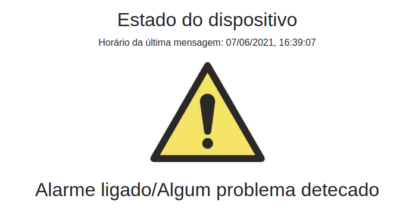
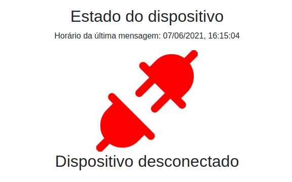

#Manual do Usuário

##1. Pré-Requisistos
- Conexão com a Internet;
- Sistema Operacional;
- Navegador.

##2. Acesso ao sistema
- Para acessar o site, digite a seguinte URL em seu navegador: {{ IPv4 }} ;
- Deverá aparecer a seguinte tela.

##3. Interface
- No botão Switch podemos mudar o modo de operação do dispositivo, alternando entre 'Detector de colisão' ou 'Alarme' de maneira fácil;

##4. Estado do dispositivo
- Também é mostrada o estado de conexão do dispositivo, junto com o horário da última mensagem recebida pelo dispositivo.
- Conectado:

- Problema detectado:

- Caso a lâmpada esteja indisponível, será mostrada a seguinte imagem:

##5. Configurar tempo de notificação
- Logo abaixo temos a opção de configurar o tempo de espera que o dispositivo fica publicando as informações atuais para o sistema.
